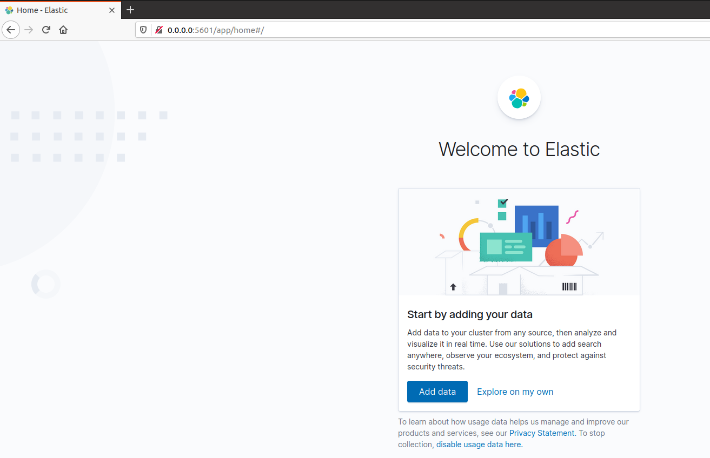

## Laboratorio Elasticsearch

### Laboratorio 1 - Introducción

#### Requisitos

  * Docker versión >= 19.03
  * jq

#### Objetivos

  * Levantar un entorno de desarrollo de Elasticsearch + kibana
  * Ingestar nuestro primer documento.
  * Consultar creandos en nuestro cluster.

##### Ejercicios
##### Instalación Elasticsarch/kibana. Parte 1

Realizaremos el despliegue del entorno de desarrollo de elasticsearch de tipo `single node` haciendo uso de contenedores docker. 

Para ello crearemos una `network` de forma que podamos asignarle una IP estática al nodo de elasticsearch para facilitarnos el trabajo en futuros ejercicios. 

A posteriori levantaremos kibana y comprobaremos que podemos acceder. 

1. Creamos una subred con docker que nos permite asignar direcciónes estáticas.

```bash
docker network create --subnet=172.18.1.0/27 elastic_network
```

2. Levantamos un nodo de elasticsearch indicandole:

  * --net: Nombre de la red docker
  * --ip: Dirección ip asignanda al contenedor. Debe ser una dirección válida para la red indicada previamente.
  * -e "discovery.type=single-node": Indicamos mediante variable de entorno que será un cluster de tipo single node.
  * --name: Nombre del contenedor

```bash
docker run -d --net elastic_network --ip 172.18.1.2 -e "discovery.type=single-node" --name elasticsearch docker.elastic.co/elasticsearch/elasticsearch:7.10.0
```

3. Levantamos kibana.

  * --net: Nombre de la red docker
  * -e SERVER_NAME=172.18.1.2:9200: Dirección contra la que debe resolver el cluster de elasticsearch

```bash
docker run -e SERVER_NAME=172.18.1.2:9200 --net elastic_network -d --name kibana -p 5601:5601 docker.elastic.co/kibana/kibana:7.10.0
```

4. Accedemos a la URL de kibana.

  Si lo pasos previos han ido bien ya tendremos accesible nuestro kibana en localhosts, puerto 5601 `http://localhost:5601/app/home#/`

  


##### Ingestando nuestro primer documento. Parte 2

Vamos a ingestar nuestro primer documento haciendo uso de la api que elasticsearch.
A posteriori consultaremos el indice que se ha creado y borraremos el indice.

1. Vamos a ingestar nuestro primer documento en elasticsearch. 

  ```bash
  curl -XPUT "http://172.18.1.2:9200/mi_primer_indice/_doc/1" -H 'Content-Type: application/json' -d'{"title":"Miprimerdocumentoenelasticsearch","category":"DocumentoSimple","author":{"first_name":"Pepito","last_name":"Grillo"}}'
  ```

2. Consultamos los índices en el cluster

  Si todo ha ido bien ya tendremos nuestro primer documento ingestado en elasticsearch y un índice que contiene dicho documento.

  ```bash
  ➜  ~ curl -XGET "http://172.18.1.2:9200/_cat/indices"
  green  open .apm-custom-link                fVwvr3VHRdm1sKh09xYWPw 1 0  0   0    208b    208b
  green  open .kibana_task_manager_1          jwtENLSURf-VU-0JXL-G5Q 1 0  5 165 130.1kb 130.1kb
  green  open .apm-agent-configuration        2CYX9J0HRkCpsCmvDKkuDA 1 0  0   0    208b    208b
  green  open .kibana-event-log-7.10.0-000001 4XTyMYHGQty9TV_4aNJliQ 1 0  1   0   5.6kb   5.6kb
  green  open .kibana_1                       32s4-cwuQ7uWgpxmsMq1Qw 1 0 22   7  10.4mb  10.4mb
  yellow open mi_primer_indice                67sC4QBRQTWK5SX9pFqmqg 1 1  1   0   5.8kb   5.8kb
  ```

3. Vamos a consultar el documento que acabamos de ingestar.

  ```bash
  ➜  ~ curl -s -XGET "http://172.18.1.2:9200/mi_primer_indice/_doc/1?pretty=true" | jq
  {
    "_index": "mi_primer_indice",
    "_type": "_doc",
    "_id": "1",
    "_version": 1,
    "_seq_no": 0,
    "_primary_term": 1,
    "found": true,
    "_source": {
      "title": "Miprimerdocumentoenelasticsearch",
      "category": "DocumentoSimple",
      "author": {
        "first_name": "Pepito",
        "last_name": "Grillo"
      }
    }
  }
  ```

4. Borramos el indice y todos los documentos que contenga.

  ```bash
  ➜  ~ curl -s -XDELETE "http://172.18.1.2:9200/mi_primer_indice" | jq
  {
    "acknowledged": true
  }
  ```

### 2. Laboratorio 2 - Arquitectura

  **Jugamos con las arquitecturas, añadimos nodos**
